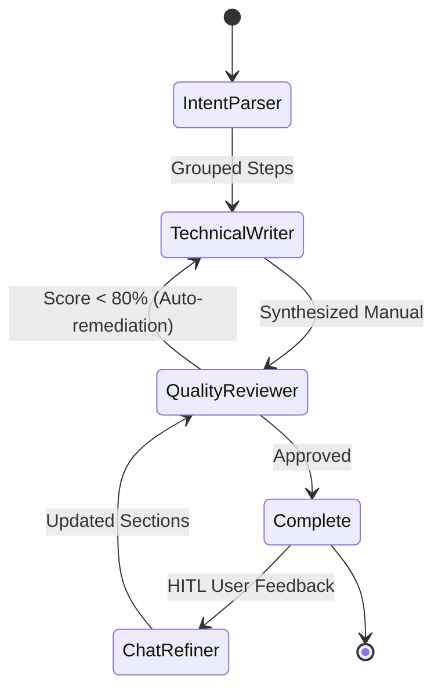

# LangGraph Multi-Agent Pipeline & Flow

The DocuAgent multi-agent workflow operates as a state graph compiled with **LangGraph**:

## Agent Roles & Responsibilities

1. **Intent Parser Agent**:
   - Analyzes raw DOM clicks, keystrokes, form submissions, and page navigations.
   - De-noises micro-interactions and groups related actions into cohesive macro procedures.

2. **Technical Writer Agent**:
   - Synthesizes procedural walkthroughs with prerequisites, imperative instructions, and callouts (Tip/Warning/Note).
   - Generates formatted Markdown manuals embedded with highlighted screenshot links.

3. **Quality Reviewer Agent**:
   - Performs automated structural critique, scores clarity and completeness (0-100), and validates step numbering continuity.

4. **Chat Refiner Agent**:
   - Implements Human-in-the-Loop adjustments, re-evaluating only targeted steps without invalidating the rest of the documentation.
