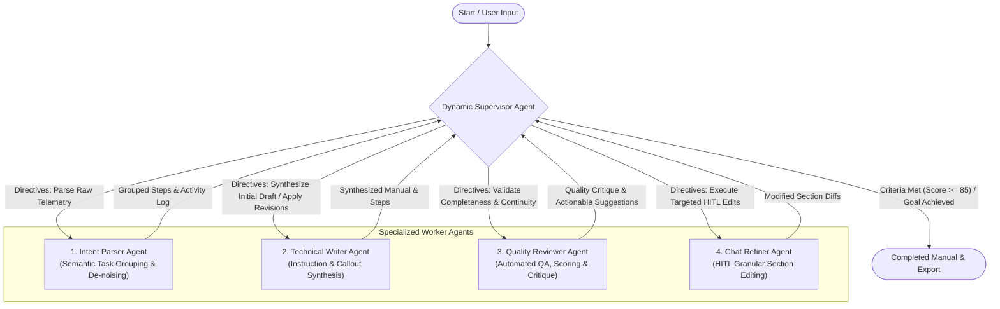

# Dynamic Multi-Agent Autonomous Network (LangGraph)

Unlike rigid, static sequential pipelines, **DocuAgent AI** employs an autonomous, dynamic **Supervisor-Worker StateGraph** pattern. Agents interact dynamically through intelligent routing, self-correcting feedback loops, and contextual memory.

---

## 🧭 Dynamic Multi-Agent Architecture

---

## 🤖 Specialized Agent Roles

### 1. Dynamic Supervisor / Orchestrator Agent (`supervisor_node`)
- **Role**: Central reasoning orchestrator evaluating real-time graph state, user intent, critique reports, and iteration budgets.
- **Autonomous Decision Loop**:
  - Unparsed traces $\rightarrow$ Dispatches `intent_parser`.
  - Grouped steps ready $\rightarrow$ Dispatches `technical_writer` with initial synthesis directives.
  - Draft generated $\rightarrow$ Dispatches `quality_reviewer` for structural inspection and scoring.
  - Review score $< 85$ $\rightarrow$ Dynamically re-routes to `technical_writer` with targeted feedback and remediation directives.
  - Active user instruction $\rightarrow$ Dispatches `chat_refiner`, followed by dynamic verification.
  - Quality thresholds satisfied (Score $\ge 85$) or maximum iterations reached $\rightarrow$ Routes to `FINISH`.

### 2. Intent Parser Agent (`intent_parser_node`)
- Groups micro-actions into logical macro procedural tasks.
- Isolates untrusted DOM text to prevent indirect prompt injections.

### 3. Technical Writer Agent (`technical_writer_node`)
- Dynamically responds to supervisor directives (e.g. "Add warning callout to Step 2", "Expand executive summary").
- Synthesizes structured steps, prerequisites, callout blocks, and highlighted screenshot embeds.

### 4. Quality Reviewer Agent (`quality_reviewer_node`)
- Evaluates documentation against completeness, clarity, step-number ordering, and visual anchors.
- Emits actionable critique reports and quality scores $(0-100\%)$.

### 5. Chat Refiner Agent (`chat_refiner_node`)
- Executes Human-in-the-Loop natural language instructions for granular section modifications.
