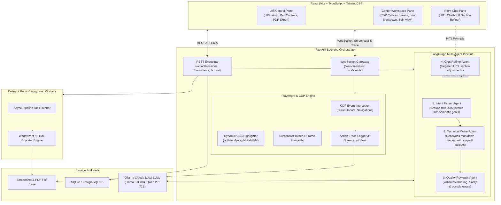

# DocuAgent AI — Architecture Blueprint & Implementation Plan

DocuAgent AI is an enterprise-grade autonomous documentation engine that captures live browser interactions in real-time, highlights target DOM elements, and synthesizes structured technical walkthroughs using a multi-agent LangGraph pipeline powered by Ollama Cloud LLMs.

---

## 1. System Architecture

---

## 2. Component Breakdown

### 2.1 Frontend Subsystem (`/frontend`)
- **Left Control Pane**: URL setup, optional auth credentials injection, session recording controls (Start/Pause/Stop/Generate), and export triggers.
- **Center Workspace Pane**:
  - **Browser Screencast Canvas**: Renders real-time JPEG/WebP frames from Playwright CDP screencast and forwards mouse/keyboard inputs back to the browser session.
  - **Live Markdown Manual Preview**: Instant rendering with syntax highlighting, step tags, and visual screenshot embeds.
  - **Split View / Tab View**: Side-by-side view of active recording and generated manual.
- **Right Chat Pane**: Human-in-the-loop conversational interface allowing targeted instruction (e.g., "Make step 3 more concise", "Omit login page").

### 2.2 Playwright & CDP Recording Engine (`/backend/app/engine`)
- **CDP Screencast Stream**: Uses `Page.startScreencast` to emit lightweight frame streams to the React canvas.
- **Dynamic DOM Highlighter**: Injects JavaScript mutation and event listeners to automatically highlight target elements (`outline: 4px solid #ef4444; box-shadow: 0 0 10px rgba(239,68,68,0.5);`) prior to snapshotting.
- **Action-Trace Logger**: Standardizes DOM events (selector, element tag, inner text, action type, coordinates, timestamp, screenshot path) into a structured JSON schema.

### 2.3 LangGraph Multi-Agent Pipeline (`/backend/app/agents`)
1. **Intent Parser Agent**: Evaluates raw clicks/keystrokes and groups repetitive or low-level micro-actions into macro procedural steps (e.g., grouping "Click input -> Type email -> Type password -> Click submit" into "Authenticate User").
2. **Technical Writer Agent**: Transforms structured steps into polished technical documentation with prerequisites, action lists, UI highlights, callouts (Notes/Tips/Warnings), and troubleshooting.
3. **Quality Reviewer Agent**: Performs structural checks, validates step continuity, verifies screenshot associations, and gives a quality score with auto-remediation recommendations.
4. **Chat Refiner Agent**: Enables localized edits to individual steps without invalidating or recomputing the entire document graph.

### 2.4 Celery, Redis & Export Engine (`/backend/app/workers` & `/exporter`)
- **Async Task Execution**: Offloads heavy multi-agent LLM reasoning and WeasyPrint PDF compilation to background Celery workers.
- **WeasyPrint PDF Engine**: Renders clean, publication-ready PDF documents using customizable Jinja2 HTML/CSS templates.
