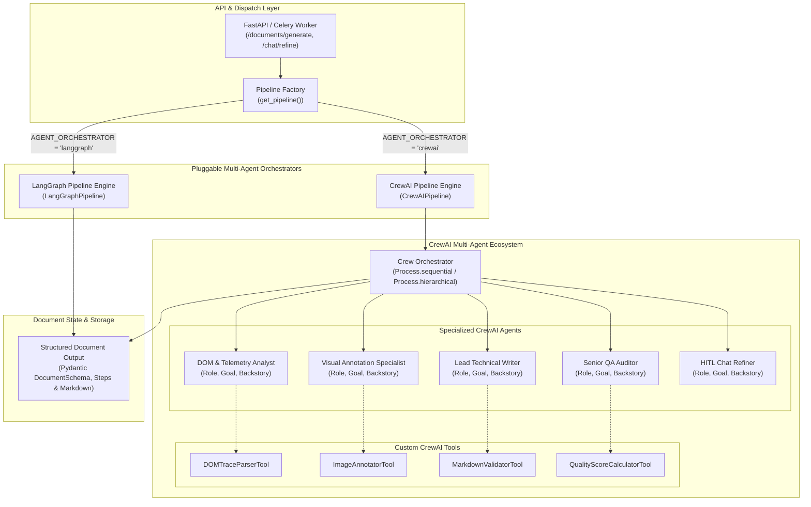

# CrewAI Implementation & Features Plan for DocuAgent AI

## 🎯 Goal Description
The objective of this initiative is to introduce **CrewAI** as a first-class autonomous multi-agent orchestration engine within **DocuAgent AI**. 

DocuAgent AI currently utilizes LangGraph for dynamic supervisor-worker state graph routing. By integrating CrewAI, DocuAgent AI gains role-playing agent specialization, explicit role/goal/backstory definitions, custom task tooling, configurable execution processes (Sequential & Hierarchical Manager delegation), and structured Pydantic task outputs. 

We will implement a **Pluggable Orchestration Architecture** (`BaseAgentPipeline` interface) that allows DocuAgent AI to operate seamlessly with either **CrewAI** or **LangGraph** (configurable via environment variables or runtime settings), ensuring backward compatibility, zero downtime, and a clear upgrade path.

---

## 🏗️ Architecture & Component Overview

---

## 🌟 Key Features of the CrewAI Implementation

### 1. Specialized Role-Playing Agents
Each agent in the crew is modeled with explicit personas, responsibilities, and cognitive boundaries:
- **Telemetry & Intent Analyst (`intent_analyst`)**:
  - *Role*: Senior User Behavior & Telemetry Analyst.
  - *Goal*: Clean, de-noise, and cluster raw browser CDP telemetry (clicks, inputs, navigations) into coherent macro user tasks.
  - *Backstory*: Expert in human-computer interaction and event logs who transforms messy interaction traces into crystal-clear goal outlines.
- **Visual Annotation Specialist (`visual_specialist`)**:
  - *Role*: Visual UX & SOP Annotation Specialist.
  - *Goal*: Process interaction screenshots, calculate element coordinates, draw red/neon highlight boxes, attach numbered step callout badges, generate focus crops, and redact sensitive PII.
  - *Backstory*: Precision graphic designer specialized in technical manuals, ensuring every visual cue is clear and focused.
- **Lead Technical Writer (`technical_writer`)**:
  - *Role*: Principal Technical Documentation Architect.
  - *Goal*: Author comprehensive, accessible, step-by-step SOP manuals and Markdown documentation with prerequisites, warnings, and embedded visual assets.
  - *Backstory*: Award-winning software documentarian following Google/Microsoft technical writing style guides.
- **Senior QA & Compliance Auditor (`quality_auditor`)**:
  - *Role*: Lead Technical Documentation QA & Compliance Inspector.
  - *Goal*: Audit the generated manual for completeness, step continuity, visual alignment, and structural integrity, outputting structured Pydantic QA scorecards.
  - *Backstory*: Rigorous technical editor who ensures zero ambiguity, valid link/image references, and high educational value.
- **Interactive Chat Refiner (`chat_refiner`)**:
  - *Role*: Human-in-the-Loop Refinement Specialist.
  - *Goal*: Execute targeted user requests to edit, rewrite, split, or add callouts to individual steps without altering the rest of the manual.
  - *Backstory*: Dedicated technical support engineer adept at instantly turning user feedback into precise document revisions.

### 2. Custom CrewAI Tools
- **`DOMTraceParserTool`**: Extracts and structures recorded CDP actions, element tags, attributes, and user input values.
- **`ImageAnnotatorTool`**: Integrates with the existing `ImageAnnotator` to generate annotated PNGs, numbered badges, and cropped sub-regions on disk.
- **`MarkdownValidatorTool`**: Validates markdown syntax, heading levels, image path validity, and code formatting.
- **`QualityScoreCalculatorTool`**: Programmatically computes structural metrics (step counts, average instruction length, callout counts, score >= 85 logic).

### 3. Configurable Execution Processes
- **Sequential Process (`Process.sequential`)**:
  - Structured, deterministic data flow from `Trace Parsing` $\rightarrow$ `Visual Annotation` $\rightarrow$ `Markdown Synthesis` $\rightarrow$ `QA Auditing`.
  - Context passing between tasks using CrewAI's `context=[previous_task]` dependency chaining.
- **Hierarchical Process (`Process.hierarchical`)**:
  - Autonomous Crew Manager allocating tasks dynamically and requesting revisions if quality checks fail.
- **Chat Refinement Crew**:
  - Lightweight single-agent or dual-agent crew executing targeted updates with user history memory.

### 4. Pluggable Multi-Agent Pipeline Interface
- Common `BaseAgentPipeline` abstraction ensuring FastAPI endpoints and Celery tasks remain completely agnostic of the underlying agent framework.
- Seamless toggling between `crewai` and `langgraph` via `AGENT_ORCHESTRATOR` in `.env` and `/settings` API.

---

## 📋 Proposed Changes

### Dependency & Configuration Layer

#### [MODIFY] `backend/requirements.txt`
- Add `crewai>=0.80.0` and `crewai-tools>=0.14.0`.

#### [MODIFY] `backend/app/core/config.py`
- Add `AGENT_ORCHESTRATOR: str = "crewai"` (options: `crewai`, `langgraph`).
- Add `CREWAI_PROCESS_MODE: str = "sequential"` (options: `sequential`, `hierarchical`).
- Add `CREWAI_MEMORY_ENABLED: bool = False`.

#### [MODIFY] `.env.example`
- Expose `AGENT_ORCHESTRATOR=crewai` and `CREWAI_PROCESS_MODE=sequential`.

---

### Agent Pipeline & CrewAI Engine Layer

#### [NEW] `backend/app/agents/base.py`
- Define abstract base class `BaseAgentPipeline`:
  - `async def generate_document(session_id: str, target_url: str, raw_action_traces: list[dict], workflow_intent: str | None = None) -> dict`
  - `async def refine_document(document_dict: dict, user_instruction: str, target_step_number: int | None, history: list[dict]) -> dict`

#### [NEW] `backend/app/agents/crewai/`
- Directory containing all CrewAI modules:
  - `backend/app/agents/crewai/__init__.py`
  - `backend/app/agents/crewai/config.py` — Agent roles, goals, backstories, and task descriptions.
  - `backend/app/agents/crewai/tools.py` — Custom CrewAI tools (`DOMTraceParserTool`, `ImageAnnotatorTool`, `MarkdownValidatorTool`).
  - `backend/app/agents/crewai/llm.py` — LiteLLM / Ollama / OpenAI model adapter for CrewAI.
  - `backend/app/agents/crewai/pipeline.py` — `CrewAIPipeline` implementing `BaseAgentPipeline`.
  - `backend/app/agents/crewai/crew.py` — Crew creation, task chaining, and execution runner.

#### [NEW] `backend/app/agents/langgraph/pipeline.py`
- Wrap existing LangGraph state graph into `LangGraphPipeline` implementing `BaseAgentPipeline`.

#### [NEW] `backend/app/agents/factory.py`
- `AgentPipelineFactory.get_pipeline(orchestrator_type: str | None = None) -> BaseAgentPipeline`
- Dynamically instantiate `CrewAIPipeline` or `LangGraphPipeline`.

---

### API & Worker Integration

#### [MODIFY] `backend/app/api/v1/endpoints/documents.py`
- Refactor `generate_document_from_session` to use `AgentPipelineFactory.get_pipeline()`.

#### [MODIFY] `backend/app/api/v1/endpoints/chat.py`
- Refactor `refine_document_section` to use `AgentPipelineFactory.get_pipeline()`.

#### [MODIFY] `backend/app/workers/tasks/pipeline_tasks.py`
- Refactor Celery task `run_agent_pipeline_task` to execute through `AgentPipelineFactory.get_pipeline()`.

---

### Settings & Frontend UI

#### [MODIFY] `backend/app/schemas/settings.py` & `backend/app/api/v1/endpoints/settings.py`
- Expose `agent_orchestrator` and `crewai_process_mode` in settings read and update endpoints.

#### [MODIFY] `frontend/src/types/settings.ts`
- Add `agent_orchestrator?: 'crewai' | 'langgraph'` and `crewai_process_mode?: 'sequential' | 'hierarchical'`.

#### [MODIFY] `frontend/src/components/settings/SettingsModal.tsx`
- Add an Orchestration Engine selector radio/dropdown (CrewAI vs LangGraph) with descriptive badges.

---

## 🔍 Verification Plan

### Automated Tests
1. **Pipeline Factory Tests**:
   - `pytest backend/tests/test_pipeline_factory.py` — Verifies factory instantiates correct engine based on configuration.
2. **CrewAI Custom Tools Tests**:
   - `pytest backend/tests/test_crewai_tools.py` — Validates `DOMTraceParserTool`, `ImageAnnotatorTool`, and `MarkdownValidatorTool`.
3. **CrewAI Document Generation Test**:
   - `pytest backend/tests/test_crewai_pipeline.py` — Runs mock telemetry through `CrewAIPipeline` and validates output conforms to `DocumentSchema` (structured steps, executive summary, callouts, markdown).
4. **Chat Refinement Test**:
   - `pytest backend/tests/test_crewai_refinement.py` — Tests targeted step modification via CrewAI refiner.
5. **Existing Regression Suite**:
   - `pytest backend/tests/test_health.py backend/tests/test_security.py`

### Manual Verification
1. **Live Recording & Generation**:
   - Launch backend and frontend.
   - Run a short interactive browser recording session on a sample page.
   - Click "Generate SOP Manual" with `AGENT_ORCHESTRATOR=crewai`.
   - Verify generated manual contains formatted steps, screenshots with callouts, and QA scores.
2. **Interactive Chat Refinement**:
   - In the Right Chat Pane, issue a prompt: "Add a warning note to step 1 about verifying network connection".
   - Confirm step 1 is updated with the warning callout without breaking the remaining steps.
3. **Settings Engine Switching**:
   - Open Settings Modal, switch engine to `LangGraph`, trigger generation.
   - Switch back to `CrewAI`, trigger generation. Verify both function cleanly.

---

## 💬 User Review Required

> [!NOTE]
> CrewAI uses LiteLLM under the hood for model routing. We will configure CrewAI to transparently support your configured `OLLAMA_BASE_URL` (local or cloud) as well as OpenAI/Anthropic keys.

> [!IMPORTANT]
> The pluggable architecture ensures that existing LangGraph implementations remain 100% operational as a fallback or selectable alternative.
