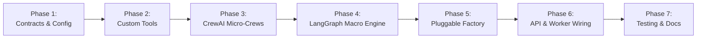

# Engineering Development Plan: Hybrid LangGraph-CrewAI Orchestrator

## 🎯 Goal Description
This development plan outlines the end-to-step engineering execution for implementing the **Hybrid Dynamic Orchestration Architecture** in **DocuAgent AI**.

In this architecture:
- **LangGraph** operates as the **Macro-State Controller** (managing global state, conditional gating on QA Score $\ge 85$, loop limits $\le 3$, HITL branch interrupts, and error recovery).
- **CrewAI** operates as the **Micro-Crew Specialist Operator** inside the state nodes (executing role-playing agents, backstories, and custom Pydantic tools).
- **Pluggable Factory Interface (`BaseAgentPipeline`)** provides backward-compatible fallback to standalone CrewAI or standalone LangGraph.

---

## 🗺️ Implementation Roadmap & Milestones

---

## 🚀 Phase-by-Phase Execution Plan

### Phase 1: Dependencies, Configuration & Data Contracts
**Objective**: Establish environment dependencies, Pydantic data schemas, and pipeline contracts.

- [ ] **1.1 Dependency Installation**:
  - Update `backend/requirements.txt` with `crewai>=0.80.0`, `crewai-tools>=0.14.0`, `pydantic>=2.9.0`.
- [ ] **1.2 Settings & Environment Variables**:
  - Update `backend/app/core/config.py` and `.env.example`:
    - `AGENT_ORCHESTRATOR: str = "hybrid"` (`hybrid`, `crewai`, `langgraph`)
    - `MAX_REVISION_LOOPS: int = 3`
    - `QUALITY_THRESHOLD_SCORE: int = 85`
    - `CREWAI_PROCESS_MODE: str = "sequential"`
- [ ] **1.3 Base Pipeline Abstract Interface**:
  - Create `backend/app/agents/base.py` with `BaseAgentPipeline` defining `generate_document()` and `refine_document()`.
- [ ] **1.4 Common Pydantic Output Schemas**:
  - Create `backend/app/agents/common/schemas.py`:
    - `ParsedStepTrace`: Structured step representation from raw telemetry.
    - `ParsedTelemetryResult`: Telemetry grouping result with intent summary.
    - `SynthesizedStepItem`: Technical manual step containing title, instruction, callouts, and screenshot URLs.
    - `QualityScorecard`: Pydantic QA audit report (`score`, `is_approved`, `suggestions`, `missing_items`).
    - `RefinementResult`: Result of interactive section editing.

---

### Phase 2: Custom Pydantic-Validated Tools for CrewAI
**Objective**: Build reusable CrewAI tools interfacing directly with DocuAgent telemetry and image processing engines.

- [ ] **2.1 DOM & Telemetry Tool (`backend/app/agents/common/tools/dom_parser.py`)**:
  - `DOMTraceParserTool`: Parses raw CDP JSON traces, removes noise (unfocused hovers, empty scrolls), extracts CSS selectors, target inner text, input values, and timestamps.
- [ ] **2.2 Visual Processing Tools (`backend/app/agents/common/tools/image_annotator.py`)**:
  - `ImageAnnotatorTool`: Interfaces with `app.engine.image_annotator.ImageAnnotator` to generate red/neon outline overlays, numbered circular step badges, and redacted PII bounding boxes.
  - `FocusCropTool`: Generates balanced 420x260 focus crops centered around target element coordinates.
- [ ] **2.3 QA & Compliance Tools (`backend/app/agents/common/tools/markdown_qa.py`)**:
  - `MarkdownValidatorTool`: Validates markdown syntax, heading hierarchy (`#`, `##`, `###`), step number continuity, and screenshot URL availability.
  - `QualityScoreCalculatorTool`: Computes weighted scores across Completeness (35%), Clarity (35%), and Structural Integrity (30%).

---

### Phase 3: Specialized CrewAI Micro-Crews & LLM Adapter
**Objective**: Define dedicated role-playing micro-crews with explicit goals, backstories, and task definitions.

- [ ] **3.1 LLM Adapter for CrewAI (`backend/app/agents/common/llm.py`)**:
  - Build helper `get_crewai_llm()` supporting Ollama (local/cloud), OpenAI, Anthropic, and LiteLLM configurations.
- [ ] **3.2 Crew Definitions (`backend/app/agents/hybrid/crews.py`)**:
  - **`IntentCrew`**:
    - Agent: *Senior User Behavior & Telemetry Analyst* (Tools: `DOMTraceParserTool`).
    - Task: Transform raw action traces into grouped procedural steps.
  - **`AuthoringCrew`**:
    - Agent 1: *Visual UX & SOP Annotation Specialist* (Tools: `ImageAnnotatorTool`, `FocusCropTool`).
    - Agent 2: *Principal Technical Documentation Architect*.
    - Task: Process visual assets, merge screenshot paths, and author Markdown SOP manual with callout blocks.
  - **`QACrew`**:
    - Agent 1: *Lead Technical Documentation QA Auditor* (Tools: `MarkdownValidatorTool`, `QualityScoreCalculatorTool`).
    - Agent 2: *Documentation Compliance Inspector*.
    - Task: Audit manual against quality guidelines and produce structured `QualityScorecard`.
  - **`ChatCrew`**:
    - Agent: *Human-in-the-Loop Refinement Specialist*.
    - Task: Execute targeted modifications on specific steps according to user prompts.

---

### Phase 4: LangGraph Macro-State Graph & Hybrid Pipeline Engine
**Objective**: Assemble the macro state graph in LangGraph with conditional routing, retry limits, and HITL handlers.

- [ ] **4.1 Graph State Definition (`backend/app/agents/hybrid/state.py`)**:
  - `HybridDocuAgentState` containing `session_id`, `target_url`, `raw_traces`, `grouped_steps`, `visual_assets`, `synthesized_steps`, `raw_markdown`, `quality_report`, `revision_loops`, `supervisor_feedback`, and `user_instruction`.
- [ ] **4.2 LangGraph Node Wrappers (`backend/app/agents/hybrid/nodes.py`)**:
  - `intent_parser_node`: Executes `IntentCrew` and updates `grouped_steps`.
  - `authoring_node`: Executes `AuthoringCrew` and updates `synthesized_steps` and `raw_markdown`.
  - `qa_node`: Executes `QACrew` and updates `quality_report`.
  - `chat_refiner_node`: Executes `ChatCrew` for on-demand user edits.
- [ ] **4.3 Macro State Graph Assembly (`backend/app/agents/hybrid/pipeline.py`)**:
  - Define `HybridPipeline(BaseAgentPipeline)`:
    - Nodes: `intent_node`, `authoring_node`, `qa_node`.
    - Edges: `START -> intent_node -> authoring_node -> qa_node -> gate_evaluator`.
    - Conditional Evaluator:
      - If `score >= 85` OR `revision_loops >= 3` $\rightarrow$ `END`.
      - Else $\rightarrow$ `authoring_node` with targeted suggestions and incremented `revision_loops`.

---

### Phase 5: Standalone Engines & Pluggable Pipeline Factory
**Objective**: Ensure modularity, easy testing, and fallback options.

- [ ] **5.1 Standalone CrewAI Pipeline (`backend/app/agents/crewai/pipeline.py`)**:
  - Implements `BaseAgentPipeline` using pure CrewAI `Process.sequential` or `Process.hierarchical`.
- [ ] **5.2 Standalone LangGraph Pipeline (`backend/app/agents/langgraph/pipeline.py`)**:
  - Adapts existing LangGraph dynamic state graph to `BaseAgentPipeline`.
- [ ] **5.3 Pipeline Factory (`backend/app/agents/factory.py`)**:
  - `AgentPipelineFactory.get_pipeline(orchestrator_type: str | None = None) -> BaseAgentPipeline` resolving according to `settings.AGENT_ORCHESTRATOR`.

---

### Phase 6: API Endpoints, Celery Worker & Frontend Integration
**Objective**: Connect the orchestrator engine to FastAPI routes, background workers, and the UI.

- [ ] **6.1 Document Generation Endpoint (`backend/app/api/v1/endpoints/documents.py`)**:
  - Refactor to call `AgentPipelineFactory.get_pipeline().generate_document(...)`.
- [ ] **6.2 Chat Refinement Endpoint (`backend/app/api/v1/endpoints/chat.py`)**:
  - Refactor to call `AgentPipelineFactory.get_pipeline().refine_document(...)`.
- [ ] **6.3 Celery Worker Task (`backend/app/workers/tasks/pipeline_tasks.py`)**:
  - Update `run_agent_pipeline_task` to execute through `AgentPipelineFactory.get_pipeline()`.
- [ ] **6.4 Settings Schema & API (`backend/app/schemas/settings.py` & `endpoints/settings.py`)**:
  - Expose `agent_orchestrator`, `max_revision_loops`, `quality_threshold_score`.
- [ ] **6.5 Frontend Settings UI (`frontend/src/components/settings/SettingsModal.tsx`)**:
  - Add Orchestrator Engine toggle selector with informative descriptions for `Hybrid`, `CrewAI`, and `LangGraph`.

---

### Phase 7: Verification & Testing Strategy
**Objective**: Validate end-to-end functionality, tool correctness, quality gating, and prevent regressions.

- [ ] **7.1 Custom Tools Unit Tests (`backend/tests/test_crewai_tools.py`)**:
  - Test `DOMTraceParserTool` with sample CDP telemetry.
  - Test `ImageAnnotatorTool` and `FocusCropTool` with mock image coordinates.
  - Test `MarkdownValidatorTool` and `QualityScoreCalculatorTool` scoring logic.
- [ ] **7.2 Hybrid Pipeline End-to-End Tests (`backend/tests/test_hybrid_pipeline.py`)**:
  - Validate full generation flow: Intent $\rightarrow$ Authoring $\rightarrow$ QA $\rightarrow$ Approval.
  - Validate revision loop re-routing when initial score is $< 85$.
  - Validate loop cutoff when `revision_loops == 3`.
- [ ] **7.3 Pipeline Factory & Engine Switching Tests (`backend/tests/test_pipeline_factory.py`)**:
  - Test instantiation and execution across all three orchestrators (`hybrid`, `crewai`, `langgraph`).
- [ ] **7.4 Chat Refinement Tests (`backend/tests/test_chat_refinement.py`)**:
  - Test targeted step update without modifying non-target steps.
- [ ] **7.5 Existing Test Suite Run**:
  - `pytest backend/tests/test_health.py backend/tests/test_security.py`

---

## 🔒 Risk Assessment & Mitigation

| Risk | Impact | Mitigation Strategy |
| :--- | :--- | :--- |
| **LLM Output Formatting Discrepancies** | Medium | Use strict Pydantic output validation schemas on CrewAI tasks; provide deterministic rule-based fallbacks in node handlers. |
| **Infinite Revision Loops** | High | LangGraph macro state explicitly checks `revision_loops >= MAX_REVISION_LOOPS (3)` and forces completion with warning flags. |
| **Latency in Multi-Agent Execution** | Medium | Celery background task processing; fast model routing for QA and intent parsing; local Ollama concurrency support. |
| **Backward Compatibility** | High | The `BaseAgentPipeline` abstraction guarantees existing API responses and frontend contracts remain 100% identical. |
