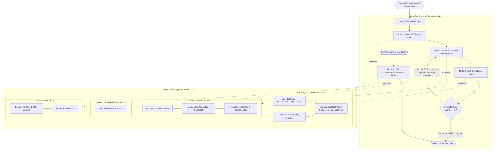

# Hybrid LangGraph-CrewAI Orchestration Engine Implementation Plan

## 🎯 Goal Description
We are upgrading **DocuAgent AI** to a **Hybrid Dynamic Orchestration Architecture** that harmonizes LangGraph and CrewAI:

1. **LangGraph (Macro-State Routing Engine)**:
   - Manages top-level state graph progression (`DocuAgentState`), historical checkpoints, and error handling.
   - Evaluates quality criteria (e.g. `Score >= 85`), routes revision feedback loops, and enforces safety bounds (`MAX_REVISION_LOOPS = 3`).
   - Orchestrates Human-in-the-Loop (HITL) natural language edits and targeted section refinements.

2. **CrewAI (Micro-Agent Specialist Execution Engine)**:
   - Operates inside LangGraph state nodes as dedicated, role-playing micro-crews.
   - Leverages explicit agent personas, goals, backstories, and custom Pydantic tools (`DOMTraceParserTool`, `ImageAnnotatorTool`, `FocusCropTool`, `MarkdownValidatorTool`, `QualityScoreCalculatorTool`).
   - Produces structured Pydantic and JSON outputs for document synthesis, visual enrichment, and QA audit reports.

3. **Pluggable Orchestration Factory (`BaseAgentPipeline`)**:
   - Offers seamless toggling between `hybrid` (default), standalone `crewai`, and standalone `langgraph`.

---

## 🏗️ Target System Architecture



---

## 👥 Specialized CrewAI Micro-Crews & Custom Tools

### 1. Crew 1: Intent & Telemetry Parsing (`intent_crew`)
- **Agent**: `Senior User Behavior & Telemetry Analyst`
  - *Role*: Senior User Behavior & Telemetry Analyst
  - *Goal*: Clean, de-noise, and cluster raw browser CDP telemetry (clicks, inputs, navigations) into coherent macro user tasks.
  - *Backstory*: Expert in human-computer interaction and event logs who transforms messy interaction traces into crystal-clear goal outlines.
- **Tool**: `DOMTraceParserTool` (Pydantic-validated tool extracting selectors, inner text, action types, input values, and timestamps).

### 2. Crew 2: Visual Annotation & Synthesis (`authoring_crew`)
- **Agent A**: `Visual UX & SOP Annotation Specialist`
  - *Role*: Visual UX & SOP Annotation Specialist
  - *Goal*: Calculate element coordinates, draw red/neon highlight boxes, attach numbered step callout badges, generate focus crops, and redact sensitive PII.
  - *Backstory*: Precision graphic designer specialized in technical manuals, ensuring every visual cue is clear and focused.
- **Agent B**: `Principal Technical Documentation Architect`
  - *Role*: Principal Technical Documentation Architect
  - *Goal*: Author comprehensive, accessible, step-by-step SOP manuals and Markdown documentation with prerequisites, warnings, and embedded visual assets.
  - *Backstory*: Award-winning software documentarian following Google/Microsoft technical writing style guides.
- **Tools**: `ImageAnnotatorTool`, `FocusCropTool` (invoking `app.engine.image_annotator.ImageAnnotator`).

### 3. Crew 3: Automated QA & Compliance (`qa_crew`)
- **Agent A**: `Lead Technical Documentation QA Auditor`
  - *Role*: Lead Technical Documentation QA Inspector
  - *Goal*: Perform structural validation, test step continuity, verify visual anchors, and compute a Pydantic quality scorecard (0–100%).
  - *Backstory*: Rigorous technical editor who ensures zero ambiguity, valid link/image references, and high educational value.
- **Agent B**: `Compliance & Integrity Inspector`
  - *Role*: Documentation Compliance Inspector
  - *Goal*: Enforce security, prerequisite clarity, and SOP standards across all generated steps.
  - *Backstory*: Compliance veteran ensuring error-free and production-ready standard operating procedures.
- **Tools**: `MarkdownValidatorTool`, `QualityScoreCalculatorTool`.

### 4. Crew 4: HITL Conversational Refinement (`chat_crew`)
- **Agent**: `Human-in-the-Loop Refinement Specialist`
  - *Role*: Human-in-the-Loop Refinement Specialist
  - *Goal*: Execute natural language user edits on specific sections without degrading surrounding steps.
  - *Backstory*: Dedicated technical support engineer adept at instantly turning user feedback into precise document revisions.

---

## 📂 Proposed Code Structure & Directory Plan

```
backend/app/agents/
├── base.py                     # Abstract Base Class (BaseAgentPipeline)
├── factory.py                  # Pipeline Factory (get_pipeline())
├── common/
│   ├── __init__.py
│   ├── schemas.py              # Common Pydantic schemas (DocumentSchema, StepSchema, QAReport)
│   └── tools/                  # Shared custom Pydantic tools
│       ├── __init__.py
│       ├── dom_parser.py       # DOMTraceParserTool
│       ├── image_annotator.py  # ImageAnnotatorTool & FocusCropTool
│       └── markdown_qa.py      # MarkdownValidatorTool & QualityScoreCalculatorTool
├── hybrid/                     # [PRIMARY ORCHESTRATOR]
│   ├── __init__.py
│   ├── state.py                # LangGraph State Definitions (DocuAgentState)
│   ├── crews.py                # CrewAI Micro-Crew definitions & task builders
│   ├── nodes.py                # LangGraph nodes wrapping embedded CrewAI executions
│   └── pipeline.py             # HybridPipeline implementing BaseAgentPipeline
├── crewai/                     # Standalone CrewAI Engine implementation
│   ├── __init__.py
│   └── pipeline.py
└── langgraph/                  # Standalone LangGraph Engine implementation
    ├── __init__.py
    └── pipeline.py
```

---

## 📋 Proposed Changes

### 1. Dependencies & Configuration Layer

#### [MODIFY] `backend/requirements.txt`
```diff
+ crewai>=0.80.0
+ crewai-tools>=0.14.0
```

#### [MODIFY] `backend/app/core/config.py`
```diff
+ AGENT_ORCHESTRATOR: str = "hybrid"  # hybrid, crewai, langgraph
+ CREWAI_PROCESS_MODE: str = "sequential"  # sequential, hierarchical
+ MAX_REVISION_LOOPS: int = 3
+ QUALITY_THRESHOLD_SCORE: int = 85
```

#### [MODIFY] `.env.example`
```diff
+ AGENT_ORCHESTRATOR=hybrid
+ CREWAI_PROCESS_MODE=sequential
+ MAX_REVISION_LOOPS=3
+ QUALITY_THRESHOLD_SCORE=85
```

---

### 2. Base Pipeline & Shared Common Tools

#### [NEW] `backend/app/agents/base.py`
- Defines `BaseAgentPipeline` abstract base class:
  ```python
  class BaseAgentPipeline(ABC):
      @abstractmethod
      async def generate_document(
          self,
          session_id: str,
          target_url: str,
          raw_action_traces: list[dict],
          workflow_intent: str | None = None,
      ) -> dict:
          """Synthesize documentation from recorded actions."""
          pass

      @abstractmethod
      async def refine_document(
          self,
          document_dict: dict,
          user_instruction: str,
          target_step_number: int | None = None,
          history: list[dict] | None = None,
      ) -> dict:
          """Apply targeted HITL refinement to generated document."""
          pass
  ```

#### [NEW] `backend/app/agents/common/schemas.py`
- Pydantic models for crew outputs: `ParsedStep`, `ParsedTelemetryResult`, `SynthesizedManualResult`, `QAReportOutput`, `RefinementOutput`.

#### [NEW] `backend/app/agents/common/tools/dom_parser.py`
- `DOMTraceParserTool` inheriting from `crewai.tools.BaseTool`: Parses action traces, formats selectors, filters noise, flags sensitive inputs.

#### [NEW] `backend/app/agents/common/tools/image_annotator.py`
- `ImageAnnotatorTool` & `FocusCropTool`: Uses `app.engine.image_annotator.ImageAnnotator` to generate highlighted callout badges, crops, and redacted images.

#### [NEW] `backend/app/agents/common/tools/markdown_qa.py`
- `MarkdownValidatorTool` & `QualityScoreCalculatorTool`: Evaluates heading structures, step number continuity, screenshot links, and computes weighted quality scores (0-100%).

---

### 3. Hybrid Orchestrator Implementation

#### [NEW] `backend/app/agents/hybrid/crews.py`
- Defines CrewAI agents and tasks for:
  - `create_intent_crew(traces, target_url)`
  - `create_authoring_crew(grouped_steps, target_url, visual_assets, directives)`
  - `create_qa_crew(markdown_content, synthesized_steps)`
  - `create_chat_crew(document, instruction, target_step_number, history)`

#### [NEW] `backend/app/agents/hybrid/nodes.py`
- LangGraph node handlers:
  - `intent_parser_node(state)`: Runs `intent_crew`, updates `grouped_steps` and `visual_assets`.
  - `authoring_node(state)`: Runs `authoring_crew`, updates `synthesized_steps` and `raw_markdown`.
  - `qa_node(state)`: Runs `qa_crew`, calculates score and sets `quality_report`.
  - `chat_refiner_node(state)`: Runs `chat_crew`, applies targeted step updates.

#### [NEW] `backend/app/agents/hybrid/pipeline.py`
- Builds and executes the LangGraph StateGraph:
  - State edges: `START -> intent_node -> authoring_node -> qa_node -> evaluator_gate`.
  - Conditional router:
    - If `score >= QUALITY_THRESHOLD_SCORE (85)` or `revision_loops >= MAX_REVISION_LOOPS (3)` $\rightarrow$ `END`.
    - Else $\rightarrow$ Re-route to `authoring_node` with targeted suggestions and increments `revision_loops`.

---

### 4. Pluggable Factory & API Layer

#### [NEW] `backend/app/agents/factory.py`
- `AgentPipelineFactory.get_pipeline(orchestrator: str | None = None) -> BaseAgentPipeline`:
  - Returns `HybridPipeline` when `hybrid` (default).
  - Returns `CrewAIPipeline` when `crewai`.
  - Returns `LangGraphPipeline` when `langgraph`.

#### [MODIFY] `backend/app/api/v1/endpoints/documents.py`
- Calls `AgentPipelineFactory.get_pipeline().generate_document(...)`.

#### [MODIFY] `backend/app/api/v1/endpoints/chat.py`
- Calls `AgentPipelineFactory.get_pipeline().refine_document(...)`.

#### [MODIFY] `backend/app/workers/tasks/pipeline_tasks.py`
- Executes async document synthesis via `AgentPipelineFactory.get_pipeline()`.

---

### 5. Frontend & Settings Layer

#### [MODIFY] `frontend/src/types/settings.ts` & `frontend/src/components/settings/SettingsModal.tsx`
- Adds multi-agent orchestrator selector (`Hybrid (LangGraph + CrewAI)` [Recommended], `Standalone CrewAI`, `Standalone LangGraph`) with visual badges and descriptions.

---

## 🔍 Verification Plan

### Automated Tests
1. **Tool Unit Tests**:
   - `pytest backend/tests/test_crewai_tools.py -v` (Tests `DOMTraceParserTool`, `ImageAnnotatorTool`, `MarkdownValidatorTool`, `QualityScoreCalculatorTool`).
2. **Hybrid Pipeline Integration Tests**:
   - `pytest backend/tests/test_hybrid_pipeline.py -v` (Tests end-to-end execution of LangGraph macro router invoking CrewAI micro-crews, quality gating, and revision loop limits).
3. **Pipeline Factory & Engine Switching Tests**:
   - `pytest backend/tests/test_pipeline_factory.py -v` (Verifies instantiation and execution across `hybrid`, `crewai`, and `langgraph`).
4. **Chat Refinement Tests**:
   - `pytest backend/tests/test_chat_refinement.py -v` (Tests HITL section editing).
5. **Full Regression Suite**:
   - `pytest backend/tests/test_health.py backend/tests/test_security.py`

### Manual Verification
1. **Workflow Generation**:
   - Record an interactive web session on a target app.
   - Trigger generation under `AGENT_ORCHESTRATOR=hybrid`.
   - Verify that output contains parsed steps, annotated screenshots with numbered badges, focus crop thumbnails, and a Quality Score report with suggestions.
2. **Quality Gate Loop Testing**:
   - Inject a low initial QA score scenario and verify LangGraph re-routes to the authoring crew up to 3 times before final completion.
3. **Chat Refinement**:
   - Open Right Chat Pane, submit "Add a caution callout to Step 2", verify Step 2 is updated without modifying Step 1 or 3.
